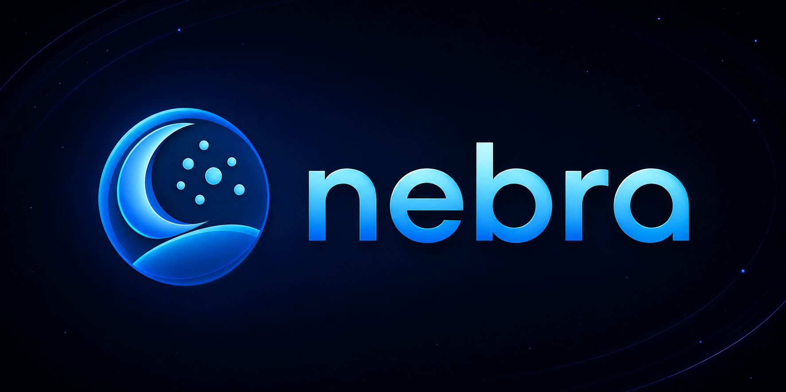

<p align="center">
  <a href="https://nebra-lang.github.io">
    
  </a>
</p>

<p align="center">
  <strong>A typed superset of Lua that transpiles to clean, portable Lua.</strong><br/>
  Classes, generics, pattern matching, async/await, modules, and a package manager - with zero runtime overhead on the Lua side.
</p>

<p align="center">
  <a href="https://github.com/nebra-lang/nebra/actions/workflows/release.yml"></a>
  <a href="https://github.com/nebra-lang/nebra/releases/latest"></a>
  <a href="LICENSE"></a>
  <a href="https://github.com/nebra-lang/nebra/issues"></a>
</p>

<p align="center">
  <a href="#why-nebra">Why Nebra</a> &bull;
  <a href="#install">Install</a> &bull;
  <a href="#coming-from-lux">From Lux</a> &bull;
  <a href="#five-minute-tour">Tour</a> &bull;
  <a href="#cli">CLI</a> &bull;
  <a href="#package-manager">Packages</a> &bull;
  <a href="https://nebra-lang.github.io">Docs</a> &bull;
  <a href="examples/">Examples</a> &bull;
  <a href="#contributing">Contributing</a>
</p>

---

## Why Nebra?

Lua is small, fast and embeddable - but writing big programs in it hurts: no static types, no module discipline, no class story, no async story. Nebra fixes that **without leaving Lua**:

- Every valid Lua program is valid Nebra - **types are optional**.
- The output is **idiomatic Lua** for any target between 5.1 and 5.4 (plus LuaJIT). No runtime library shipped, no magic at run-time.
- A full set of modern features are **lowered at compile time**: classes, generics, interfaces, pattern matching, `async/await`, doc comments, decorators-via-annotations, an ES-style module system, a strict-nil mode, and an immutability mode.
- A complete **toolchain** ships in one binary: compiler, interactive REPL, test runner, native binary bundler, package manager, language server, docs generator.

```lua
import { sum, clamp } from "lua-math"

class Counter
    count: number = 0

    function bump(by: number = 1): number
        self.count = self.count + by
        return self.count
    end
end

async function fetch(url: string): string
    return await http.get(url)
end

local c = new Counter()
c:bump()
c:bump(5)
print(c.count)              -- 6
print(clamp(c.count, 0, 5))  -- 5
```

Nebra compiles the above into clean Lua - no runtime library, no helpers you can't read.

---

## Install

### One-line install (recommended)

Detects your OS + architecture, pulls the latest release archive, extracts it, and wires `nebra` into your `PATH`. No admin rights required - everything lands under your user directory.

**Linux / macOS (bash / zsh):**

```bash
curl -fsSL https://raw.githubusercontent.com/nebra-lang/nebra/master/scripts/install.sh | bash
```

**Linux / macOS (fish - e.g. CachyOS):**

```fish
curl -fsSL https://raw.githubusercontent.com/nebra-lang/nebra/master/scripts/install.fish | fish
```

**Windows (PowerShell 5.1+):**

```powershell
irm https://raw.githubusercontent.com/nebra-lang/nebra/master/scripts/install.ps1 | iex
```

Open a new shell after the script finishes and `nebra version` should resolve. Pin a specific tag with `NEBRA_VERSION=v0.2.0` (bash / fish) or `$env:NEBRA_VERSION = "v0.2.0"` (PowerShell) before running the installer.

### Manual install

If you prefer to handle PATH yourself, grab the archive for your platform from the [latest release](https://github.com/nebra-lang/nebra/releases/latest):

| Platform        | Archive                                |
|-----------------|----------------------------------------|
| Linux x64       | `nebra-linux-x64.tar.gz`                 |
| Linux arm64     | `nebra-linux-arm64.tar.gz`               |
| macOS x64       | `nebra-osx-x64.tar.gz`                   |
| macOS arm64     | `nebra-osx-arm64.tar.gz` (Apple Silicon) |
| Windows x64     | `nebra-win-x64.zip`                      |
| Windows arm64   | `nebra-win-arm64.zip`                    |

Each archive contains a single self-contained `nebra` (or `nebra.exe`) binary - **no .NET runtime, no Lua runtime required on the target machine**. The Lua 5.4 interpreter (via KeraLua), the Nebra compiler, and all stdlib type declarations are embedded.

Extract somewhere on your `PATH`:

```bash
# Linux / macOS
tar xzf nebra-linux-x64.tar.gz
sudo mv nebra /usr/local/bin/
nebra version
```

### From source

Requires the [.NET 10 SDK](https://dotnet.microsoft.com/download).

```bash
git clone https://github.com/nebra-lang/nebra.git
cd nebra
dotnet build Nebra.sln
./compiler/bin/Debug/net10.0/Nebra version
```

### Editor support

The [**Nebra VS Code extension**](https://marketplace.visualstudio.com/items?itemName=DasDarki.nebra) is on the Marketplace. Install it from inside VS Code (Quick Open `Ctrl+P` / `Cmd+P`):

```
ext install DasDarki.nebra
```

Or via the CLI:

```bash
code --install-extension DasDarki.nebra
```

Prefer to build from source? The extension lives in [`vscode-nebra/`](vscode-nebra/):

```bash
cd vscode-nebra
npm install && npm run package
code --install-extension nebra-*.vsix
```

The extension launches the bundled `nebra lps` language server - you get hover, go-to-definition, completion, rename, find-references, semantic highlighting, code actions ("Implement interface", "Auto-import"), and signature help out of the box.

---

## Coming from Lux

Nebra was called Lux until the name collided with [lumen-oss/lux](https://github.com/lumen-oss/lux),
a Lua package manager that uses the same `lux.toml` and `lux.lock` file names. Existing projects
convert with one command:

```bash
nebra migrate --dry-run   # report what would change, write nothing
nebra migrate             # rename files and rewrite the matching tokens
```

It renames `*.lux` to `*.neb`, `lux.toml` to `nebra.toml`, `lux.lock` to `nebra.lock`, and rewrites
a fixed set of tokens (`lux_modules`, `lux:test`, `LUX_*`, `__lux*`, CLI invocations in build
scripts). Replacement is token-based rather than a blanket substitution, so your own identifiers and
prose that merely contain the word survive untouched. A copy of the project is written to
`.nebra-migrate-backup/` first.

`lux_modules/` is deliberately left alone because its contents are fetched, not authored. Delete it
and run `nebra install` afterwards.

---

## Five-minute tour

### Scaffold a project

```bash
nebra init
```

You get a `nebra.toml`, a `src/` folder, and a `.gitignore`. Drop a `src/main.neb`:

```lua
function greet(name: string): string
    return "Hello, " .. name .. "!"
end

print(greet("Nebra"))
```

### Build, run, or just iterate

```bash
nebra build        # → out/main.lua
nebra watch        # recompile src/**/*.neb on every change (Ctrl+C to stop)
nebra run          # compile + run via embedded Lua 5.4
nebra repl         # interactive prompt (state survives across inputs)
```

`nebra watch` recompiles the whole project whenever a `*.neb` file under `src/` changes
(recursively, debounced), much like `dotnet watch` or `tstl --watch`. Errors are printed
and the watcher keeps running. Tune the debounce window with `--debounce <ms>` (default 300).

### Types are optional, inference does the rest

```lua
local x = 42            -- inferred number
local name = "Nebra"       -- inferred string
local arr = {1, 2, 3}    -- inferred number[]

function len<T>(xs: T[]): number  -- generics
    return #xs
end
```

### Strict-nil mode kills the billion-dollar mistake

```toml
preset = "strict"
```

```lua
local name: string? = maybeName()
print(name:upper())             -- ✗ compile error: name may be nil
print(name!:upper())             -- ✓ explicit non-null assertion
print(name?:upper())             -- ✓ optional chaining: yields nil if name is nil
print((name ?? "anon"):upper())  -- ✓ nil-coalescing
```

### Classes + interfaces

```lua
interface Greetable
    function greet(): string
end

abstract class Animal
    name: string
    legs: number = 4

    constructor(name: string)
        self.name = name
    end

    abstract function speak(): string
end

class Cat extends Animal implements Greetable
    constructor(name: string)
        super(name)
    end

    override function speak(): string
        return "meow"
    end

    function greet(): string
        return "hi, I'm " .. self.name
    end
end
```

Generated Lua uses metatables and `setmetatable(self, Class)` - no helper library, no shimming.

### Pattern matching with exhaustiveness checks

```lua
enum Status { Pending, Done, Failed }

local result = match status
    case Status.Pending then "still working"
    case Status.Done then "✓"
    case Status.Failed when retries < 3 then "retrying"
    case _ then "giving up"
end
```

Type-patterns work too: `case x: Dog then x:bark()`.

### Async / await on coroutines

```lua
async function load(url: string): string
    return await http.get(url)
end

local body = await load("https://example.com")
```

Compiles to a coroutine + a `__done` callback. No external scheduler required - works on every Lua target.

### Modules, the ES way

```lua
-- math/vec2.neb
export class Vec2
    x: number
    y: number
    constructor(x: number, y: number) self.x, self.y = x, y end
end

-- main.neb
import { Vec2 } from "math/vec2"
import * as utils from "lib/utils"
import "polyfill"            -- side-effect import

local v = new Vec2(1, 2)
```

### Declaration files

Type any existing Lua code without recompiling it. `stdlib/std.d.neb` ships built-in declarations for `print`, `string`, `math`, `table`, `io`, `os`, etc. Add your own with `globals = ["lib/myproject.d.neb"]` in `nebra.toml`.

```lua
-- redis.d.neb
declare module "redis"
    function connect(host: string, port: number): RedisClient
    interface RedisClient
        function get(key: string): string?
        function set(key: string, value: string): boolean
    end
end
```

### Annotations (compile-time metaprogramming)

```lua
@deprecated("use Vec2 instead")
function oldVec(x, y): { x: number, y: number }
    return { x = x, y = y }
end
```

Annotations are Nebra functions that run at compile time and rewrite the IR - powerful enough to implement decorators, lazy initialization, runtime validators, anything you can express by transforming a syntax tree.

### Bundle as a standalone binary

```bash
nebra compile                 # produces ./<project-name> on Linux/macOS
nebra compile --out ./myapp   # custom output path
```

The result is a single self-contained executable: your compiled Lua + KeraLua + all transitive deps from `nebra_modules/`, packed into one file. Ships on a machine that has neither Lua nor .NET.

---

## CLI

| Command                  | Description                                              |
|--------------------------|----------------------------------------------------------|
| `nebra init`               | Scaffold a new project in the current directory          |
| `nebra create <spec>`      | Scaffold from a git template (e.g. `gh:owner/template`)  |
| `nebra build [files...]`   | Compile the project (or specific files) to Lua           |
| `nebra watch`              | Recompile `src/**/*.neb` on every change (debounced)     |
| `nebra run [files...] [-- args]` | Compile and execute via embedded Lua 5.4           |
| `nebra test [filter]`      | Discover and run unit tests (`*_test.neb`, `tests/`)     |
| `nebra repl`               | Interactive REPL with persistent runtime state           |
| `nebra compile`            | Bundle the project into a standalone native binary       |
| `nebra docs [--out dir]`   | Generate documentation site (Markdown + HTML)            |
| `nebra install`            | Install dependencies into `nebra_modules/`                 |
| `nebra add <spec>`         | Add a runtime dependency (e.g. `github:owner/repo@v1`)   |
| `nebra remove <name>`      | Remove a declared dependency                             |
| `nebra registry refresh`   | Refresh the cached alias registry                        |
| `nebra lps`                | Start the LSP language server over stdio                 |
| `nebra migrate [dir]`      | Convert a project from the old `lux` toolchain to Nebra   |
| `nebra version`            | Print the Nebra version                                  |
| `nebra help`               | Show CLI help                                            |

The installer also links `neb` as a shorthand, so `neb build` and `nebra build` are the same command.

Detailed flags and behavior live in the [CLI reference](https://nebra-lang.github.io/docs/toolchain/cli).

---

## Package Manager

Nebra ships with a built-in, git-based package manager. Dependencies are declared in `nebra.toml` and installed into a local `nebra_modules/` directory:

```toml
[dependencies]
nebra-strings = "github:DasDarki/nebra-strings@v1.2.0"
lua-math    = { git = "https://example.com/lua-math.git", tag = "v0.5.0" }
my-utils    = "file:../my-utils"   # local path for development
```

```bash
nebra install          # fetch + link everything
nebra add github:owner/cool-lib@v1
nebra remove cool-lib
```

**Monorepos** - when a single repository contains more than one Nebra package, point at the
package's subdirectory. Either append the in-repo path to the host shortcut, or use the
table form with `subdir`:

```bash
nebra add github:owner/monorepo/packages/math@v1   # path after owner/repo = subdir
```

```toml
[dependencies]
math = { git = "https://github.com/owner/monorepo.git", tag = "v1", subdir = "packages/math" }
```

Nebra sparse-checks only that subdirectory and reads its `nebra.toml` for the dependency name.

The package manager is roundtrip-safe with `nebra.toml` (preserves formatting + comments on `nebra add`/`remove`), supports lifecycle scripts gated behind `--allow-scripts`, and resolves transitive dependencies via per-package `nebra.toml` files.

See the [package manager guide](https://nebra-lang.github.io/docs/toolchain/package-manager) for the full specification.

---

## Project Structure

```
.
├-- compiler/          Nebra compiler + CLI (.NET 10)
│   ├-- Compiler/       Pass pipeline (ResolveLibs → BindDeclare → … → Codegen)
│   ├-- IR/             High-level IR (Node hierarchy, ScopeGraph, SymbolArena, TypeTable)
│   ├-- Configuration/  nebra.toml schema
│   ├-- Diagnostics/    Error/warning bag with formatted codes
│   ├-- PackageManager/ Git-based dependency installer
│   ├-- LPS/            Language server (OmniSharp LSP framework)
│   ├-- Doc/            Doc comment parser + markdown/HTML renderer
│   └-- stdlib/         Built-in .d.neb declarations + test framework Lua
├-- runtime/           Embedded Lua 5.4 runtime (KeraLua wrapper, stdlib bindings)
├-- examples/          Example projects (nebra-strings, lua-math, zoo-app)
├-- test/              Runtime test suite (181 tests, all passing)
├-- vscode-nebra/      VS Code extension source
└-- assets/            Logo & branding
```

The compiler and runtime are split: `compiler/Nebra.csproj` produces the `nebra` CLI and references `runtime/Nebra.Runtime.csproj`. The runtime project contains everything a standalone binary produced by `nebra compile` needs - no compiler types.

---

## Architecture

```
.neb source
    ↓ ANTLR4 lexer + parser
CST
    ↓ IRVisitor (visitor over the parse tree)
HIR (Node tree)
    ↓ Pass pipeline:
    │   ResolveLibs       Load .d.neb declarations + installed packages
    │   ResolveAnnotations  Pre-load annotation plugins
    │   ApplyAnnotations  Run compile-time IR rewrites
    │   BindDeclare       Build scope graph + declare symbols
    │   ResolveImports    Inject imported module ASTs into the package
    │   ResolveNames      Bind every NameRef to its SymID
    │   ResolveTypeRefs   Resolve type annotations to TypIDs
    │   CheckImmutability Enforce const + deep-freeze rules
    │   InferTypes        Propagate types, narrow nilability, check operators
    │   ValidateGenericConstraints
    │   DetectUnused      Mark unreferenced symbols for stripping
    │   DeclGen           Emit .d.neb declarations for the project (optional)
    │   Mangle            Rename for minification (optional)
    │   Codegen           Emit target Lua source
    ↓
.lua output
```

Each pass declares its scope (per-file or per-build) and dependencies. The `PassManager` topologically orders them. A separate `CheckPipeline` (same minus `Mangle` and `Codegen`) is used by the language server for fast incremental feedback while you type.

---

## Documentation

The full language reference, guides and examples live at **[nebra-lang.github.io](https://nebra-lang.github.io)**.

- [Getting Started](https://nebra-lang.github.io/docs/getting-started/installation) - install, first project, editor setup
- [Type System](https://nebra-lang.github.io/docs/language/types) - primitives, unions, generics, `never`
- [Classes](https://nebra-lang.github.io/docs/language/classes) - inheritance, abstract, `protected`, `static`, operators
- [Interfaces](https://nebra-lang.github.io/docs/language/interfaces) - `implements`, interface inheritance, default methods
- [Modules](https://nebra-lang.github.io/docs/language/modules) - `import`/`export`, declaration modules
- [Pattern Matching](https://nebra-lang.github.io/docs/language/pattern-matching) - value/type/wildcard patterns, guards
- [Nilability](https://nebra-lang.github.io/docs/language/nilability) - strict-nil, `??`, `!`, `?.`, flow narrowing
- [CLI Reference](https://nebra-lang.github.io/docs/toolchain/cli) - every command, every flag
- [Package Manager](https://nebra-lang.github.io/docs/toolchain/package-manager) - dependency specs, install pipeline
- [Annotations](https://nebra-lang.github.io/docs/advanced/annotations) - compile-time IR rewrites
- [Configuration](https://nebra-lang.github.io/docs/advanced/configuration) - every `nebra.toml` key
- [Examples](https://nebra-lang.github.io/docs/examples/overview) - complete, runnable programs

The site is built from [nebra-lang/nebra-lang.github.io](https://github.com/nebra-lang/nebra-lang.github.io).

---

## Examples

Three runnable projects in [`examples/`](examples/):

- [`nebra-strings/`](examples/nebra-strings/) - a tiny Nebra library exposing string utilities (`trim`, `padLeft`, `startsWith`, `capitalize`).
- [`lua-math/`](examples/lua-math/) - a pre-built Lua library with typed `.d.neb` declarations (`clamp`, `lerp`, `vec2`, `length2`).
- [`zoo-app/`](examples/zoo-app/) - an app that consumes both libraries via the package manager. Demonstrates cross-language imports and standalone binary bundling.

```bash
cd examples/zoo-app
nebra install      # pulls nebra-strings + lua-math
nebra run          # → Welcome, Whiskers! …
nebra compile      # → ./zoo-app  (standalone)
```

---

## Roadmap

Current status:

- ✅ Type system with inference, nilability, generics, exhaustive matching, immutability, operator overloading
- ✅ Classes, interfaces, abstract, override, protected, static, operator overloading
- ✅ Pattern matching, async/await, defer/guard, label-free continue, multi-level break
- ✅ Module system, declaration files, declaration generation
- ✅ Annotations (compile-time IR rewriting)
- ✅ Package manager (5 phases: install, toml round-trip, alias registry, auto-discovery, lifecycle scripts)
- ✅ Doc comments + markdown/HTML doc generation
- ✅ Embedded Lua 5.4 runtime + `nebra run`
- ✅ Standard library declarations + stdlib bindings (HTTP, JSON, FS, Console, Project)
- ✅ Test runner (`nebra test`) with built-in `nebra:test` framework
- ✅ Standalone binary compiler (`nebra compile`)
- ✅ Interactive REPL (`nebra repl`)
- ✅ Language server (hover, go-to-def, completion, rename, references, code actions, sig help, semantic tokens)
- ✅ Runtime reflection metadata + `reflect` library
- ✅ `never` type with unreachable-code detection and flow narrowing
- ✅ Named function fields in table constructors
- ✅ `nebra migrate` for projects built with the old `lux` toolchain
- ⏳ Formatter for consistent code style

---

## Contributing

Issues and pull requests are welcome at [github.com/nebra-lang/nebra](https://github.com/nebra-lang/nebra). Before opening a PR:

1. Run the test suite - it must stay green.
   ```bash
   cd test && nebra test
   ```
2. Keep generated parser files (`compiler/CodeAnalysis/`) out of your diff - regenerate via `cd compiler && ./gen_antlr4.sh` only when you touch the grammar.
3. Follow the existing style: XML doc comments on public APIs, no comments on obvious code.
4. New language features should also extend the LSP (`compiler/LPS/`) so editor support stays consistent.

For substantial changes, please open an issue first to discuss the design.

---

## License

[MIT](LICENSE) © DasDarki
